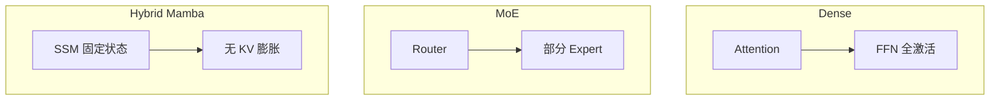

# Langchain Getting Started（接 Ollama + 本地模型选型）

> [!summary]
> **本地 RAG · 第 2 部分**。LangChain 作中间层接本地 Ollama：装 `langchain` + `langchain-ollama` → 可选 **LangSmith** 追踪 → **`ChatOllama`** 的 `invoke` / `stream`。字幕 021–028 补 **选型**（VRAM / Dense·MoE·Mamba）；029–036 补 **生态、观测、包结构**。默认 `http://localhost:11434`。

上一篇：[[01_Ollama Setup]] · 环境：[[杂项]] · 下一篇：[[Chat Prompt Templates]]（或仓库内 [[03_Prompt Templates]]）

主要链接：

- [langchain.com](https://www.langchain.com)
- Ollama 模型库：<https://ollama.com>
- ChatOllama 集成文档：<https://python.langchain.com/docs/integrations/chat/ollama/>
- LangSmith：<https://smith.langchain.com>（端点 `https://api.smith.langchain.com`）
- Monorepo：<https://github.com/langchain-ai/langchain>
- 私有可观测（可选）：[Langfuse](https://langfuse.com) · [Opik](https://www.comet.com/site/products/opik/)

## 本章目录

| 章节 | 学什么 |
| --- | --- |
| §1 定位 | 中间层；LangChain / LangSmith / LangGraph |
| §2 安装 | 两包、连带依赖；勿用 community 的 ChatOllama |
| §3 LangSmith | `.env` 四变量、注册 Key、Dashboard 看什么 |
| §4 ChatOllama | 显式参数；换模型名；自定义模型 |
| §5 调用 | `invoke` / `stream` / `response_metadata` |
| §6 本地选型 2026 | VRAM、架构、编码与 tokens/s |
| §7 仓库结构一眼 | `libs/partners` vs `core` vs `community` |
| 文末实践代码 | 最小可跑示例 |

---

## 1. 定位：中间层做什么

```text
用户 / 应用
  → LangChain（ChatOllama 等）
  → Ollama（Serving + 本地模型）
  → 再经 LangChain 回到应用
```

直接对 Ollama 写 REST（`/api/generate`、`/api/chat`）能用，但接 prompt、工具、RAG 组件时很碎。LangChain 把这些收成统一 Python API。

| 产品 | 角色 | 本笔记 |
| --- | --- | --- |
| **LangChain** | LLM 应用框架（prompt、loader、splitter、parser、tool…） | 重点 |
| **LangSmith** | 云端可观测 / 评估（自动记 I/O、耗时、token） | §3 |
| **LangGraph** | 复杂 Agent / 图工作流 | 后续；先打好 LangChain |

Agent、RAG 也能先用 LangChain 做；课程建议**不要跳过基础直接上 LangGraph**。集成数量很多，本课主线是 **`langchain-ollama`**。

| 之前（[[01_Ollama Setup]]） | 现在 |
| --- | --- |
| GUI / CLI / 裸 curl | Python 统一接口 |
| Modelfile 焊人设 | 代码里换 `model=`；动态 System 见 part 3 |
| 凭感觉选模型 | §6 用 VRAM + 架构 + 实测 |

---

## 2. 安装

```bash
pip install langchain
pip install langchain-ollama
pip install python-dotenv   # 给 LangSmith / .env 用
```

装 `langchain` 时常会带上：`langchain-core`、`langchain-community`、`langsmith`、`pydantic`、`langchain-text-splitters` 等。

模型先拉好：

```bash
ollama pull qwen3
# 或 qwen3.5:4b / nemotron3-nano:4b / llama3.2:1b …
```

> [!warning]
> 用 **`from langchain_ollama import ChatOllama`**。`langchain_community` 里的 ChatOllama **已不推荐**（集成迁到 partners，见 §7）。

---

## 3. LangSmith：可选可观测

### 3.1 何时用 / 何时不用

| 方案 | 类型 | 适用 |
| --- | --- | --- |
| **LangSmith** | 官方云 | 学习调试方便；**私有数据不宜上传** |
| **Langfuse / Opik** | 可自托管 | 私有 LLM、本地 Ollama、敏感数据 |

纯本地调用**可以不配**；配了之后业务代码**不用手写 tracer**，`invoke` / `stream` 会自动上报。

### 3.2 注册与 `.env`

1. 打开 [smith.langchain.com](https://smith.langchain.com) → 注册/登录（可用 GitHub）
2. **Settings → API → Create API Key**（Personal 或 Service Token）→ 复制
3. 在项目可用的路径建 `.env`（**勿提交密钥**）：

```env
LANGCHAIN_API_KEY=lsv2_pt_...
LANGCHAIN_TRACING_V2=true
LANGCHAIN_ENDPOINT=https://api.smith.langchain.com
LANGCHAIN_PROJECT=ollama-langchain
```

```python
from dotenv import load_dotenv
import os

load_dotenv("./../.env")  # .env 不在当前目录时要传路径
os.environ["LANGCHAIN_API_KEY"]  # 验证已加载
```

在正确的 conda/venv（课例 `ml`，见 [[杂项]]）里安装并跑。

### 3.3 Dashboard 看什么

登录 → **Projects** → 打开与 `LANGCHAIN_PROJECT` 同名的项目。

| 层级 | 常见信息 |
| --- | --- |
| 项目汇总 | 调用次数、成功率、总 token、平均延迟、异常长延迟 |
| 单次 Run | 组件 `ChatOllama`、模型名、Human input、AI output、token、Provider: Ollama |
| 失败 | connection error、中断等也会留下记录，可按状态筛选 |

代码里的 `response.response_metadata`（模型、参数、库版本等）可与 UI 对照。

---

## 4. `ChatOllama`：最小配置

`langchain-ollama` 常见三类：**ChatModel（主推）**、Embeddings、旧式 LLM（少用）。本笔记用 Chat：

```python
from langchain_ollama import ChatOllama

llm = ChatOllama(
    base_url="http://localhost:11434",  # 远程只改 IP/域名
    model="qwen3",                      # ollama list 里的名字
    temperature=0.8,
    num_predict=256,
)
```

| 参数 | 含义 |
| --- | --- |
| `base_url` | 缺了容易 **connection error** |
| `model` | 库模型或自定义名（`sheldon` / `sherlock` 等） |
| `temperature` | 随机性；代码/SQL 常调低 |
| `num_predict` | 最大生成长度量级 |

> [!important]
> **`model` / `temperature` / `num_predict` 等要在构造器里显式传。** 课程口径：Ollama 服务端 Modelfile / UI 里的参数**不会**自动带进 `ChatOllama`。

换模型只改 `model=`。教育向演示：先 `ollama list` 确认已登记的自定义模型，再把名字写进 `ChatOllama`——与是否「uncensored」无关，本质是**同一套 API 换本地权重名**。

---

## 5. 调用：`invoke` / `stream` / metadata

```text
invoke  → 等整段 → AIMessage（.content）
stream  → 逐块 AIMessageChunk → 适合长回答
```

```python
response = llm.invoke("用三句话解释什么是 RAG。")
print(response.content)
print(response.response_metadata)

for chunk in llm.stream("用三句话解释什么是 RAG。"):
    print(chunk.content, end="", flush=True)
```

取正文用 **`.content`**，不要直接 `print` 整个 message 对象。已配 LangSmith 时，上述调用会进 §3 的项目页。

---

## 6. 本地模型选型

接 LangChain 前先定「跑得动、任务够」。课程硬件口径：**目标 ≤24GB VRAM**；演示机常为 **RTX 5090（32GB）**。tokens/s 随机器变。入口：[ollama.com](https://ollama.com)。

### 6.1 VRAM（Q4 粗估）

```text
仅权重 ≈ 参数量 × 0.5 字节
实际 = 权重 + Vision / MoE 路由 / Mamba 状态 / tokenizer / KV 或 SSM + 上下文
```

| 模型（课程口径） | 约占用 | 拆解直觉 |
| --- | --- | --- |
| Nemotron 3 Nano **4B** | ~2.8GB（卡面约 2.4GB） | 权重 ~2GB + SSM/开销 |
| Qwen3.5 **9B**（多模态） | ~6.6GB | 权重 ~4.5GB + Vision ~0.9GB |
| Nemotron **30B** / Qwen3.5 **35B** MoE | ~24GB | 权重大 + 路由/状态/开销 |
| Mixtral（MoE） | ~24–26GB | 量化后可进 24GB 档 |

「文件 ≈ 24GB」≠「24GB 卡很舒服」——还要给上下文等留余量。

### 6.2 Dense / MoE / Hybrid Mamba



| 架构 | 例子 | 速度 | 质量直觉 |
| --- | --- | --- | --- |
| Dense | Qwen3.5 9B / 35B Dense | 往往最慢 | 通常最稳 |
| MoE | Mixtral、Qwen3.5 **35B-a3b**（~3B active） | 更快 | 中等 |
| Hybrid Mamba | Nemotron 3 Nano | 很快 | 常让位于速度 |

**总参 ≠ 激活参**（`a3b` ≈ Active 3B）。口诀：要吞吐偏 Mamba/MoE；要准偏 Dense。

### 6.3 编码与速度（课程结论）

| 档位 | Hard | Medium |
| --- | --- | --- |
| **4B**（Nemotron / Qwen3.5） | 基本不够 | 均可过；Qwen 更稳、Nemotron 更快 |
| **30B / 35B** | 课例 Hard 可过 | — |

| 模型（5090、verbose 量级） | 约 tokens/s |
| --- | --- |
| Qwen3.5 4B Dense | ~60–70 |
| Nemotron 4B Mamba | ~100–169 |
| Qwen3.5 35B Dense | ~53 |
| Nemotron 30B | ~160 |
| Qwen3.5 35B-a3b MoE | 快于同系列 Dense 35B |

```text
接 ChatOllama → ollama pull 成功 → model="确切名字"
```

---

## 7. 仓库结构一眼
录课时对比（数字会变）：LangChain GitHub 体量明显大于 LlamaIndex；生态采用面更大。源码在 [langchain-ai/langchain](https://github.com/langchain-ai/langchain) 的 **`libs/`**：

| 路径 | 包直觉 | 记什么 |
| --- | --- | --- |
| `libs/partners/` | 如 **`langchain-ollama`** | 官方集成；**ChatOllama 在这里** |
| `libs/core/` | `langchain-core` | messages、prompts、parsers、embeddings… |
| `libs/langchain/` | 高层 agents / chains 等 | 与 core 有重叠，后续再细辨 |
| `libs/text-splitters/` | 切分 | RAG 用 |
| `libs/community/` | `langchain-community` | 大量集成已迁 partners，**旧 import 勿再用** |

`ChatOllama` 的本质：把通用调用转成 Ollama 的 REST/chat 请求（正确 URL、路径、载荷）——即 §1 的 middleman；换模型名即可，不必手写 HTTP。

---

## 文末实践代码

```python
# pip install langchain langchain-ollama python-dotenv

from dotenv import load_dotenv
from langchain_ollama import ChatOllama

load_dotenv("./../.env")  # 可选；无私有数据追踪需求可省略

llm = ChatOllama(
    base_url="http://localhost:11434",
    model="qwen3",
    temperature=0.8,
    num_predict=256,
)

msg = llm.invoke("用三句话解释什么是 RAG。")
print(msg.content)
print(msg.response_metadata)

# for chunk in llm.stream("用三句话解释什么是 RAG。"):
#     print(chunk.content, end="", flush=True)
```

## 相关笔记

- [[01_Ollama Setup]] — 安装、CLI、Modelfile、Raw API
- [[杂项]] — Conda / PyTorch
- [[Chat Prompt Templates]] / [[03_Prompt Templates]] — 消息与提示模板
