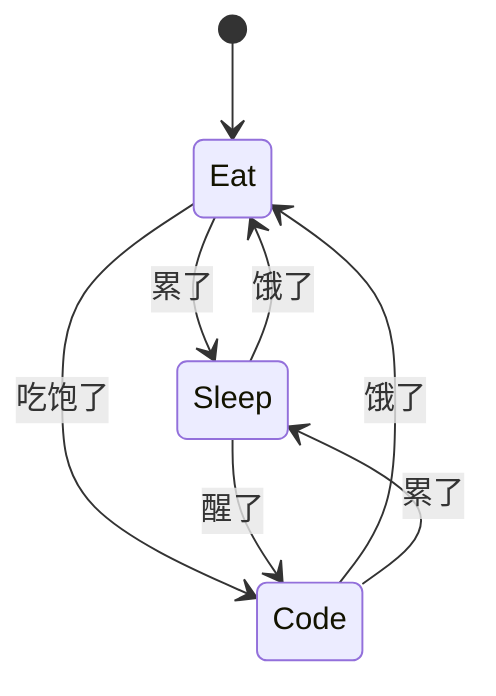
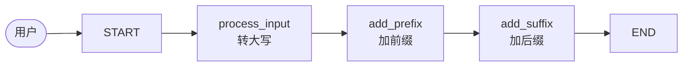
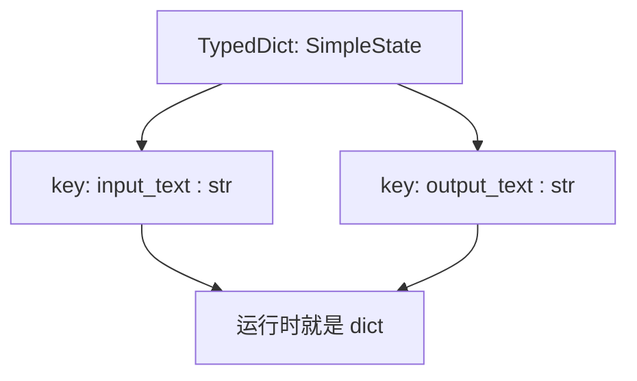
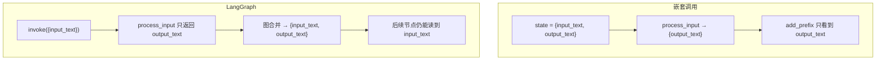
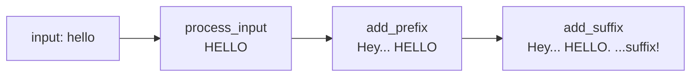

# LangGraph Getting Started（状态 · 节点 · 边）

> [!summary]
> **本地 RAG · 第 16 部分**。LangGraph = 流程工程 + 有限状态机：用 `TypedDict` 定义 **State**，用 Python 函数当 **Node**，用 `add_edge` 连 **Edge**，装进 `StateGraph` 画布后 `compile()` 成 Runnable，再 `invoke`。重点对比：**嵌套函数调用**只传你返回的字段；**图执行**会按 State schema 维护/过滤字段。

前置：[[02_Langchain]] · 环境：[[杂项]] · Agent 侧可对照：[[12_ Agents]]

主要链接：

- [LangGraph 文档](https://langchain-ai.github.io/langgraph/)
- Notebook：`临时文件/LangGraph Getting Started.ipynb`（可删）
- 课程频道：KGP Talkie

## 本章目录

| 章节 | 学什么 |
| --- | --- |
| §1 定位 | Flow Engineering / FSM；State · Node · Edge |
| §2 自定义 State | `TypedDict`；字段 = 字典键 |
| §3 自定义 Node | 参数类型提示为 State；可只返回部分键 |
| §4 嵌套调用 | `add_suffix(add_prefix(process_input(...)))` 的局限 |
| §5 建图与可视化 | `StateGraph` → `add_node` → `add_edge` → `compile` |
| §6 Invoke | 初始状态；多余键被丢掉；节点会覆盖 `output_text` |
| 文末实践代码 | Notebook 最小可跑示例 |

---

## 1. 定位：流程工程与有限状态机

LangGraph 是偏底层的编排框架，用来做**有状态**、可多步（甚至多 Agent）的工作流：每一步（节点）处理数据，再交给下一步。

三个核心概念：

| 概念 | 含义 | 本课例子 |
| --- | --- | --- |
| **State** | 节点间共享的内存（字典） | `SimpleState`：`input_text` / `output_text` |
| **Node** | 干具体事的函数 | `process_input` / `add_prefix` / `add_suffix` |
| **Edge** | 节点之间的流向 | `START → process_input → … → END` |

课程总览图（State 随节点推进；图中用 `messages` 示意「状态在追加」，本课代码实际用的是 `SimpleState`）：

![[16-langgraph-overview.png]]

### 1.1 默认 vs 自定义

- 图总有预构建节点：**START** / **END**（不用手动画上去）
- LangGraph 也有默认的 **Messages** 状态（维护对话历史）；本课先用自定义 `SimpleState`
- 中间可加条件边（`add_conditional_edges`，后续课）

### 1.2 FSM 直觉：Eat / Sleep / Code

有限状态机 = **有限个预定义状态** + **按条件转移**。

在 LangGraph 里：

- 吃 / 睡 / 写代码 → **Node**
- 「累了就睡」「醒了就写代码」「饿了就吃」→ **Edge**（可双向、可循环）
- 流转时携带的数据 → **State**



本课要搭的线性流水线：



对比 [[02_Langchain]]：`llm.invoke` 往往只拿到**最后一条 AI Message**；LangGraph 设计上可以在图执行过程中**维护状态（含历史）**——本课先看自定义字段，Messages 历史后面再加。

---

## 2. 自定义 State（TypedDict）

```python
from typing_extensions import TypedDict
from langgraph.graph import StateGraph, START, END
```

> [!note]
> 从 **`typing_extensions`** 导入 `TypedDict`（不是 `typing.extension`）。

`TypedDict` ≈ **带类型提示的字典**。类上写的字段名，会变成字典的 **key**：

```python
class SimpleState(TypedDict):
    input_text: str
    output_text: str
```



要点：

- 字段名随意（`query` / `question` 都行），但后面 **Node 返回的 key 必须一致**
- 可先当普通字典用：`SimpleState(input_text="hello", output_text="HELLO")`
- 实例化/传入时若只给部分键，未给的键不会自动出现，直到某节点写入

---

## 3. 自定义 Node

在 LangGraph 里，**自定义节点 = 普通 Python 函数**，但约定：

1. 入参用你的 State 做类型提示：`state: SimpleState`
2. 返回类型也是同一 State（或只返回要更新的字段字典）
3. 参数名习惯叫 `state`（惯例，非强制）

### 3.1 process_input：转大写

两种等价写法：

```python
# 写法 A：改 state 再整包返回
def process_input(state: SimpleState) -> SimpleState:
    state["output_text"] = state["input_text"].upper()
    return state

# 写法 B（推荐演示）：只返回要改的键
def process_input(state: SimpleState) -> SimpleState:
    output_text = state["input_text"].upper()
    return {"output_text": output_text}
```

> [!important]
> 只返回部分键时，**LangGraph 会保留其他键不变**，只更新你返回的那些。嵌套手动调用则**没有**这套合并逻辑——你返回啥，下游就只看到啥。

手动试跑：

```python
state = {"input_text": "hello", "output_text": ""}
process_input(state)
# → {'output_text': 'HELLO'}
```

### 3.2 add_prefix / add_suffix

```python
def add_prefix(state: SimpleState):
    print("Current State [Prefix]", state)
    output = "Hey, i have added something here. " + state["output_text"]
    return {"output_text": output}

def add_suffix(state: SimpleState):
    print("Current State [Suffix]", state)
    output = state["output_text"] + ". i have added suffix!"
    return {"output_text": output}
```

返回字典的 key（`output_text`）必须与 `SimpleState` 字段名一致。

---

## 4. 嵌套调用 vs 真正的图

还没建图时，可以嵌套函数模拟流水线：

```python
add_prefix(process_input(state))
add_suffix(add_prefix(process_input(state)))
```

观察：

| | 嵌套 Python 调用 | LangGraph 图执行 |
| --- | --- | --- |
| 传给下一节点的内容 | 你 `return` 的字典（常只有 `output_text`） | 按 State schema **合并**，全程维护键 |
| `input_text` | 下游往往看不到 | 从初始 state 起一直保留（除非被删） |
| 调试 print | 打印的就是你传入的那份 dict | 打印时通常能看到完整 SimpleState |



所以课程强调：先理解「节点是函数 + 返回部分更新」，再建图才能体会 **State 在节点间如何被维护**。

---

## 5. 建图：StateGraph 当画布

`StateGraph` = 画布。创建时传入自定义 State，之后画布上所有节点都共享这份 schema。

```python
def create_simple_graph():
    builder = StateGraph(SimpleState)

    # 加节点：标签名建议 = 函数名
    builder.add_node("process_input", process_input)
    builder.add_node("add_prefix", add_prefix)
    builder.add_node("add_suffix", add_suffix)

    # 连边：START / END 是预构建节点，不用 add_node
    builder.add_edge(START, "process_input")
    builder.add_edge("process_input", "add_prefix")
    builder.add_edge("add_prefix", "add_suffix")
    builder.add_edge("add_suffix", END)

    # compile → LangChain Runnable
    graph = builder.compile()
    return graph
```

Notebook 里 `compile()` 后直接显示 `graph` 得到的结构图：

![[16-langgraph-graph.png]]

```text
__start__ → process_input → add_prefix → add_suffix → __end__
```

要点：

- `add_node(标签, 函数)`：标签用于可视化与连边
- 还有 `add_conditional_edges` / `add_sequence` 等（后续）
- `compile()` 后可 `invoke`；以后还会传 **checkpointer** 等参数

```python
graph = create_simple_graph()
graph  # Jupyter 中渲染图结构
```

---

## 6. Invoke：状态如何变化

```python
initial_state = {"input_text": "hello"}
graph.invoke(initial_state)
# → {'input_text': 'hello',
#    'output_text': 'Hey, i have added something here. HELLO. i have added suffix!'}
```

`output_text` 在节点间如何被改写：



### 6.1 对比嵌套调用

嵌套时最终往往只有 `output_text`；图执行后 **`input_text` 仍在**——整块画布按 `SimpleState` 维护初始传入的键（以及节点写入的键）。

### 6.2 多余字段会被丢掉

```python
initial_state = {"input_text": "hello", "some_other_state": "hi"}
graph.invoke(initial_state)
# some_other_state 不会进入结果：不在 SimpleState schema 里
```

进入图后，状态会按 `SimpleState` 约束；未声明的字段相当于被过滤。

### 6.3 初始 output_text 会被节点覆盖

```python
initial_state = {"input_text": "hello", "output_text": "hi"}
graph.invoke(initial_state)
# 你传入的 "hi" 无意义：process_input / prefix / suffix 会改写 output_text
```

`output_text` 由节点逻辑控制，不是「初始值一直保留」。

### 6.4 本课尚未做的事

当前图只维护**当前状态字段**，**没有**像 Messages 那样追加历史消息。后续会学：在 State 里用合适方式维护 conversation history。

---

## 实践代码（最小可跑）

依赖：`langgraph`、`typing_extensions`（环境见 [[杂项]]）。

```python
from typing_extensions import TypedDict
from langgraph.graph import StateGraph, START, END


class SimpleState(TypedDict):
    input_text: str
    output_text: str


def process_input(state: SimpleState) -> SimpleState:
    return {"output_text": state["input_text"].upper()}


def add_prefix(state: SimpleState):
    print("Current State [Prefix]", state)
    return {
        "output_text": "Hey, i have added something here. " + state["output_text"]
    }


def add_suffix(state: SimpleState):
    print("Current State [Suffix]", state)
    return {"output_text": state["output_text"] + ". i have added suffix!"}


def create_simple_graph():
    builder = StateGraph(SimpleState)
    builder.add_node("process_input", process_input)
    builder.add_node("add_prefix", add_prefix)
    builder.add_node("add_suffix", add_suffix)
    builder.add_edge(START, "process_input")
    builder.add_edge("process_input", "add_prefix")
    builder.add_edge("add_prefix", "add_suffix")
    builder.add_edge("add_suffix", END)
    return builder.compile()


graph = create_simple_graph()
print(graph.invoke({"input_text": "hello"}))
```

预期输出字段大致为：

```text
input_text: hello
output_text: Hey, i have added something here. HELLO. i have added suffix!
```

（运行时 Prefix/Suffix 的 `print` 在图模式下通常能看到完整 state，含 `input_text`。）

---

## 速查

| API / 概念 | 作用 |
| --- | --- |
| `TypedDict` | 定义 State schema |
| `StateGraph(State)` | 画布；绑定状态类型 |
| `add_node(name, fn)` | 注册节点 |
| `add_edge(a, b)` | 固定流向 |
| `START` / `END` | 预构建起止节点 |
| `compile()` | → Runnable |
| `graph.invoke(dict)` | 跑图；传入初始 state |
| 节点 `return {部分键}` | 图内合并更新；嵌套调用则整份替换 |

---

## 相关笔记

- [[02_Langchain]] — Runnable / `invoke` 基础
- [[12_ Agents]] — Agent 底层常基于 LangGraph
- [[杂项]] — Conda / 依赖环境
- [[06_Chat Message Memory]] — 对话历史（对照「本课尚未做 Messages State」）

## 待处理

- [ ] 条件边 `add_conditional_edges`
- [ ] `compile(checkpointer=...)` 与持久化
- [ ] Messages State：在图里维护历史消息列表
- [ ] 字幕 1–6 英文 `.srt` 与 notebook 源文件是否从 `临时文件/` 清理
