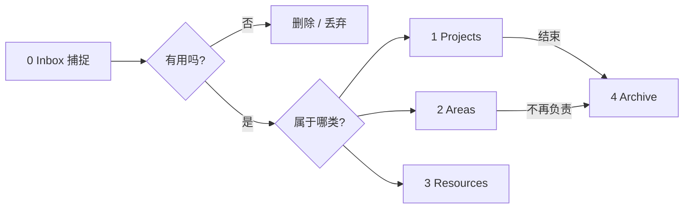

# Obsidian 入门（PARA、Inbox 与可用工作流）

> [!summary]
> 目标不是堆插件，而是尽快搭出一套**每天能用的笔记系统**：本地 Markdown Vault + [[PARA]] 目录 + Inbox 收件箱处理 + 最少必要的快捷键 / 模板 / 备份。先写笔记、再慢慢定制。

课程示例库目录（本仓库旁）：`0 Inbox` · `1 Projects` · `2 Areas` · `3 Resources` · `4 Archive` · `templates`。

## 本章目录

| 章节 | 学什么 |
| --- | --- |
| §1 为什么选 Obsidian | 本地文件、跨端、可与 Neovim 共存 |
| §2 创建 Vault | 本地库、外观与 Vim 键位 |
| §3 结构思路 | 纯链接堆 vs 文件夹；入门用 PARA |
| §4 PARA | Projects / Areas / Resources / Archive |
| §5 目录落地 | 数字前缀排序；Inbox 为默认新建位置 |
| §6 Inbox 工作流 | 捕捉 → 定期处理 → 链接 → 归位 |
| §7 键盘化处理 | Quick Explorer + Move file |
| §8 Neovim / Git / 模板 | 兼容、备份、Templater |
| 文末速查 | 设置项、快捷键、插件清单 |

---

## 1. 为什么选 Obsidian

作者路线：Notion 等多工具试过 → Obsidian 真正「点亮」→ 再用 Neovim / Bash 操作同一套 Vault，同时保留 Obsidian 的可视化能力。

核心理由：

1. **本地 Markdown**：数据在自己手里，不绑死某一 SaaS。
2. **工具可互换**：Obsidian 与 Neovim 读写同一目录；手机端用 Obsidian 也比纯文件夹更顺手。
3. **先兼容 Obsidian**：从 Obsidian 起步，后续加终端工作流更稳。

> [!note]
> 原则：系统要同时兼容「图形界面」和「纯 Markdown 目录」，而不是二选一。

---

## 2. 创建 Vault

1. 安装后选择 **Create new vault**（macOS 也可选 iCloud Vault）。
2. 指定本地路径，例如 `Documents/Obsidian Example Vault/...`。
3. 首次打开是几乎空的库（可能有 Welcome 类默认笔记）。

建议起步设置：

| 位置 | 建议 |
| --- | --- |
| Appearance | 主题按喜好（课程用 Dark） |
| Editor → Vim key bindings | 可选；开启前会考 Vim 退出命令 `:q` |

---

## 3. 结构思路：两种极端

整理笔记结构很容易掉进「优化无底洞」。入门阶段记住只有两条路：

| 路线 | 做法 | 适合 |
| --- | --- | --- |
| 扁平 + 链接 | 文件堆在一起，靠 `[[链接]]` 建结构 | 已习惯图谱 / 搜索 |
| 目录结构 | 用文件夹表达语境 | 多数人更直觉，适合起步 |

课程建议：**先用目录（PARA）起步**；以后若要扁平化，写脚本把 `.md` 挪到同一层也不难。

---

## 4. PARA（Tiago Forte）

PARA = **Projects · Areas · Resources · Archive**。既是文件夹分类，也是对「生活与思考」的切割方式。

### 4.1 Projects（项目）

- **短期**、有明确结果的一组任务与笔记。
- 接近 GTD：需要多步才能完成的 outcome。
- 例子：阳台花园、写一个返回天气的 Go API、规划 2024 假期。
- 做法：为项目建文件夹，相关调研、任务、草稿都放进去，像实体文件夹。

### 4.2 Areas（领域）

- **长期责任**，持续存在、需要定期回顾。
- 例子：房屋维护、技术博客、学校社群、职业、家庭、志愿工作。
- 对比：技术博客可能从「做一个项目」开始，后来变成「持续负责的领域」。

### 4.3 Resources（资源）

- **预计将来有用**的参考资料集合。
- 多为兴趣 / 主题知识库：Golang、Linux、城市园艺、挪威旅行灵感等。
- 例子：刷到挪威徒步路线 → 先丢进「挪威假期」资源；真要规划旅行时再翻出来。

### 4.4 Archive（归档）

- **当前 / 近期不用**，但也不想删的内容。
- 已完成的项目、卸任的领域，都可整夹移入 Archive。
- 价值：日常主要靠搜索；某天归档笔记可能重新变有用。也可在搜索里排除 Archive。

可对照示例笔记：[[PARA]]。



---

## 5. 目录落地

### 5.1 推荐顶层结构

| 文件夹 | 含义 |
| --- | --- |
| `0 Inbox` | 收件箱：所有新笔记默认落点 |
| `1 Projects` | 进行中的项目 |
| `2 Areas` | 长期领域 |
| `3 Resources` | 主题资源 |
| `4 Archive` | 归档 |
| `templates` | 模板（如 Zettel template） |

数字前缀的原因：

1. **固定 PARA 顺序**（否则按字母会变成 Areas → Archive → …）。
2. **终端友好**：`cd 0` / `cd 1` Tab 补全更快（无空格时更省事）。
3. 作者后期为了界面好看改用带空格的名字（`0 Inbox`）；脚本多时，无空格命名更省心。成熟后主要靠搜索（Telescope / Obsidian 搜索），对 `cd` 依赖会下降。

### 5.2 把「新建笔记」指向 Inbox

设置路径：

**Settings → Files and links → Default location for new notes → In the folder specified below → `0 Inbox`**

效果：`Cmd/Ctrl + N` 一律进 Inbox，而不是 Vault 根目录。

---

## 6. Inbox 工作流

### 6.1 捕捉（Capture）

场景：写代码卡住、读 Hacker News、洗碗时冒出「想去挪威 Jotunheimen」——先开笔记记下，**当场不整理**。

节奏建议：

- 每天处理一次（作者偏好），或至少每周一次。
- 避免 Inbox 积到上百条才动手——会不知道从哪开始。

### 6.2 处理（Process）

对每条 Inbox 笔记：

1. **补一点自己的想法**（别只贴链接）。
2. **至少加一条 `[[链接]]`**（可链到尚未存在的笔记；图谱上会出现虚节点）。
3. **移动到**对应 Project / Area / Resource；无用则删除（进系统废纸篓即可）。

课程演示归类：

| Inbox 内容 | 去向 | 链接思路 |
| --- | --- | --- |
| Idea about Holiday in Norway | `1 Projects/Holiday 2024` | → Planning Holiday 2024；也可链 Nordic mythology（可先不存在） |
| Sweden is a great country for hiking too | 同上项目 | → 规划笔记、挪威想法等 |
| Motion Blur | `3 Resources/Filmmaking` | → Filmmaking；写下对文章的看法 |
| Azure 容器网关文章想法 | `2 Areas/Tech blog` | 博客点子常从 Inbox 起步 |

> [!tip]
> Obsidian 的力量在链接：每篇至少一条链接，图谱会慢慢长出兴趣簇；某主题被链很多次时，就是该认真开一篇正式笔记的信号。

---

## 7. 键盘化：处理 Inbox

拖拽可以，但处理 20 条时更适合键鼠分离工作流。

### 7.1 插件

1. 开启 **Community plugins**
2. 安装并启用 **Quick Explorer**（偏旧但够用）

### 7.2 关键快捷键（课程示例，macOS；Windows 多为 Ctrl/Alt）

| 动作 | 绑定示例 | 用途 |
| --- | --- | --- |
| Quick Explorer：浏览文件/文件夹 | `Cmd + Y` | 打开后按 `0` → Enter → Enter 进入 Inbox 第一条 |
| Move current file to another folder | `Cmd + M` | 输入 `holiday` / `tech` 等模糊匹配目标文件夹 |
| 打开/搜索文件 | `Cmd + O` | 快速打开任意笔记 |

循环：`Cmd+Y` → `0` → Enter×2 → 编辑 / 加链接 → `Cmd+M` 移走 → 重复。

---

## 8. Neovim、Git、模板

### 8.1 与 Neovim 共存

Vault 就是普通文件夹。终端进入 `0 Inbox` 后：

```bash
nvim neovimnote.md
```

Obsidian 侧立刻能看到同一文件。平时也可用 Telescope 等按内容搜全库——这是「本地 Markdown」的红利。

### 8.2 备份与同步

| 方案 | 角色 |
| --- | --- |
| iCloud Vault（Apple 生态） | 多设备实时同步（作者主力） |
| Git + **Obsidian Git** 插件 | 第二备份 / 跨系统；可定时 commit & push |

Git 起步步骤（课程演示）：

```bash
git init
git add .
git commit -m "initial commit"
git remote add origin <repo-url>
git push -u origin main   # 分支名以你仓库为准
```

插件建议配置习惯：

- 启动时 Pull
- 约每 10–15 分钟检查 / 备份
- 用命令面板 `Create backup` 自测

> [!warning]
> 私有仓库也并非绝对私密。敏感笔记要评估是否上 GitHub；作者也提到未来可能改为自建 Git + 加密镜像。

### 8.3 模板（Templater）

1. 安装并启用 **Templater**
2. 建 `templates/`，例如 `Zettel template.md`
3. Templater 设置：
   - Template folder location → `templates`
   - 开启 **Trigger Templater on new file creation**
   - Folder Templates：`0 Inbox` → `Zettel template`

Inbox 新建笔记会自动带结构（课程示例含 Links、时间戳 `<% tp.date.now("YYYYMMDDHHmm") %>` 等）。也可在 Hotkeys 里给「插入某模板」绑快捷键（如 `Cmd + I`），在非 Inbox 文件夹手动插入。

扩展：可为 `Resources/Books` 等配书摘模板（要点 / Summary / Further reading）。

示例见 [[Zettel template]]。

---

## 9. 收束：别掉进定制兔子洞

这门课浓缩的是「起步就该知道的最小可用集」。后续还可深入链接策略、标签 vs 链接等，但：

1. **先持续写笔记、从系统里拿收益**
2. 定制是爱好可以，别让优化取代产出
3. PARA + Inbox 已足够启动日常使用

---

## 文末速查

### 必做设置

- [ ] 顶层 PARA + Inbox + templates
- [ ] 新笔记默认目录 = `0 Inbox`
- [ ] （可选）Vim 键位、Dark 主题
- [ ] Community plugins：Quick Explorer、Obsidian Git、Templater
- [ ] Templater：Inbox 自动套 Zettel 模板
- [ ] 同步 / 备份策略二选一或组合：iCloud / Git

### 日常循环

```text
捕捉（随时 → Inbox）
  → 定期清空 Inbox
  → 写一句自己的想法 + 至少一条 [[链接]]
  → 移到 Project / Area / Resource（或删除）
  → 项目/领域结束 → Archive
```

### PARA 一句话

| 字母 | 问自己 |
| --- | --- |
| P | 有没有明确截止日期 / 完成标准？ |
| A | 是否长期责任、没有「做完」的一天？ |
| R | 是否主要是「以后可能参考」？ |
| A | 现在不用，但扔了会后悔？→ Archive |

### 示例库对照

| 路径 | 角色 |
| --- | --- |
| `0 Inbox/*` | 未处理捕捉（Hello World、Git Test、neovimnote…） |
| `1 Projects/Holiday 2024/` | 假期项目相关笔记 |
| `2 Areas/Tech blog/` | 长期博客领域 |
| `3 Resources/Filmmaking/`、`Notetaking/` | 主题资源 |
| `4 Archive/` | 归档 |
| `templates/Zettel template.md` | 新建笔记模板 |

---

## 相关笔记

- [[PARA]]
- [[Zettel template]]

## 待处理

- [ ] 按自己机器改快捷键（Win：Ctrl/Alt 对照）
- [ ] 决定同步方案：仅本地 / iCloud / Git / 组合
- [ ] 按需改 `Zettel template`（frontmatter、Links、时间戳）
- [ ] 进阶：链接策略、标签 vs 链接（课程预告）
